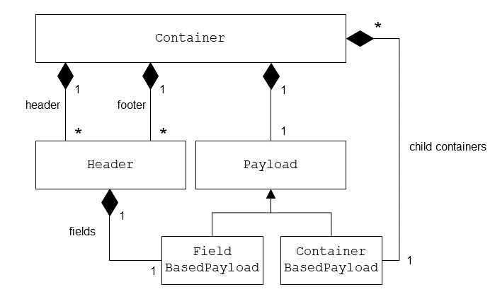
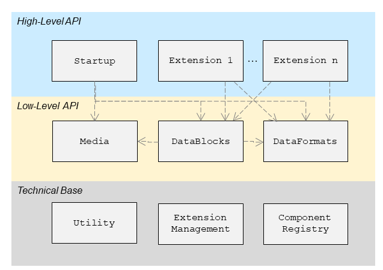
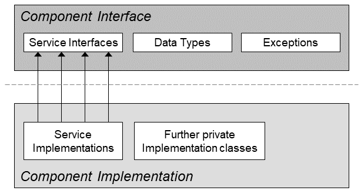
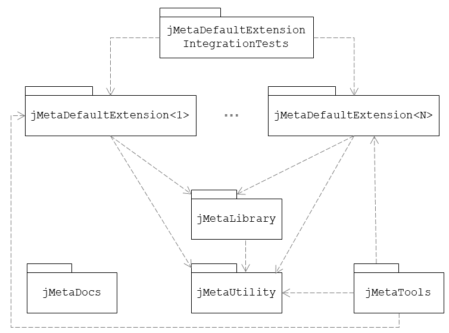

[](https://travis-ci.com/jebbard/jMeta.svg?branch=master)
<br />
# jMeta

jMeta is an extensible Java library for reading and writing multimedia metadata and container formats. It is intended for use for multimedia-heavy Java applications that do not want to dive too deep into the details of each format they support. jMeta relieves these applications of the burden to study, understand and implement the tricky details of each format out there and is itself extensible, which keeps applications based on jMeta also extensible. Examples of targeted applications are: Audio studio applications, multimedia (image, audio, video) collection applications, editing applications among others.

jMeta supports three basic types of _Media_, which is the term used for supported datasources used throughout the library:
* **File:** A usual file stored on external media, random-access and basically read-write
* **Byte-Array:** Allows to use jMeta also for data already present in-memory; random-access and read-write
* **InputStream:** The most general way to input any data; sequential and not random-access and read-only - On the plus side, this allows jMeta to be used for internet media streams, zipped files, files sent over REST APIs and read from databases and tons of other options

Currently, jMeta is in an alpha status and supports the following data formats:
* MP3
* OGG
* ID3v1 and ID3v1.1
* ID2v2.3
* APEv2
* Lyrics3v2

MPEG-4/JPEG 2000, RIFF, QuickTime and Matroska as well as ID3v2.4, VorbisComment, Lyrics3v1 and APEv1 support is in planning stages. 

All details and further links for multimedia container data formats and metadata formats can be found in the [following book authored by the creator of this library](https://drive.google.com/file/d/18KWGkUWWp9CIcfzMpfAc4rqdLS2SXWn9/view?usp=sharing).

jMeta lets you:
* Generically read both payload data and parsing metadata of the above mentioned formats down to the bit-level, if you like
* Do so from the following data sources: Input streams, files, byte arrays
* Read from data sources that contain multiple different supported data formats on top-level - the easiest example is an MP3 file consisting of various metadata tags and MP3 frames
* Define your own extensions for other binary container-like data formats to support these formats

Note that writing these data formats is currently in alpha status while also a high-level API to make reading and writing yet more comfortable is in its early stages.

## Usage Examples

Read all top-level containers of an MP3 file and print their IDs:

```java
LibraryJMeta jMeta = LibraryJMeta.getLibrary();
Medium<Path> medium = new FileMedium(Paths.get("/path/to/my/file.mp3"), false);

try (TopLevelContainerIterator containerIterator = jMeta.getDataBlockAccessor().getContainerIterator(medium)) {
    while (containerIterator.hasNext()) {
        Container container = containerIterator.next();

        System.out.println("Next container on top level has data format: " + container.getId().getDataFormat()
            + ", and id: " + container.getId());
    }
} catch (IOException e) {
    throw new RuntimeException("Error closing file medium", e);
}
```

Read an ID3v2.3 tag at the end of a multimedia file (if present) and print id and value of every text-based frame in the tag - note that there will be a high-level API in later versions of the library that encapsulates all these details for more convenient access to tags:

```java
		LibraryJMeta jMeta = LibraryJMeta.getLibrary();
		Medium<Path> medium = new FileMedium(Paths.get("/path/to/my/file.mp3"), false);

		try (TopLevelContainerIterator containerIterator = jMeta.getDataBlockAccessor()
			.getReverseContainerIterator(medium)) {
			while (containerIterator.hasNext()) {
				Container container = containerIterator.next();

				if (container.getId().getDataFormat() == ID3v23Extension.ID3v23) {
					System.out.println("Found ID3v2.3 tag");

					ContainerBasedPayload frames = (ContainerBasedPayload) container.getPayload();

					ContainerIterator frameIterator = frames.getContainerIterator();

					while (frameIterator.hasNext()) {
						Container frame = frameIterator.next();

						// It is a text frame
						if (frame.getId().getLocalId().startsWith("T")) {
							FieldBasedPayload framePayload = (FieldBasedPayload) frame.getPayload();

							List<Field<?>> fields = framePayload.getFields();

							for (Field<?> field : fields) {
								if (field.getId().getLocalId().equals("information")) {
									try {
										System.out.println(field.getInterpretedValue().toString());
									} catch (BinaryValueConversionException e) {
										throw new RuntimeException("Could not convert binary field value", e);
									}
								}
							}
						}
					}
				}
			}
		} catch (IOException e) {
			throw new RuntimeException("Error closing file medium", e);
		}
```

## Architecture

The design and architecture of jMeta is extensively covered in the [jMeta design concept](jMetaDocs/DesignConcept/jMetaDesignConcept.pdf). Here we just give a basic overview of the general architecture of jMeta.

### Container Data Format Metamodel

During design phase of jMeta, a general metamodel for (binary) containerized data format was developed that covers most if not all of these dat aformats in the multimedia area. This metamodel basically assumes hierarchical data structures, so-called containers, which are encoded into binary by using length fields on the one hand (most often) and termination bytes (in rare cases) on the other hand.

The metamodel is displayed in the following figure:



The main building block is the **Container**. A container is the general skeleton for holding precious **Payload** data. Usually, payload data is enclosed by one or several **Headers** and/or **Footers**. These define some important parsing metadata necessary to interpret the follow-up data correctly. If the data format is intended to be parsed front-to-back (as usual), it might prefer headers, otherwise footers. There are two types of payloads:
* **Container-based payload** is a means to further structure a container hierarchically - this payload is again built-up by containers which may or may not have the same structure as the top-level container
* **Field-based payload** just contains fields, which we explain shortly

**Fields** are the leaf nodes of this structure. Headers, footers and field-based payload consists of fields. Fields are either fixed length or terminated by pre-defined bytes. A field has a value that might or might not be relevant for further parsing (e.g. if it contains a size or count).

### jMeta Components

The jMeta components and their dependencies are displayed in the following figure:



They are subdivided into three parts:
* **Technical base** are some functionality-agnostic technical helper components
* **Low-level API** is the generic core of the library, managing different data formats and containing the generic reading and writing algorithms
* **High-level API** contains the high-level API of the library which is currently just consisting of a few classes, as well as extensions

The components displayed are described in the following bullet-point list:
* **Startup**: Contains the startup initialization code for jMeta, especially loading and verifying the extensions. 
* **Media**: A component responsible for reading and writing to external data sources; hides the details of this from the DataBlocks component. It implements a flushing algorithm described [in the following paper](https://drive.google.com/file/d/1hE1rE0FnVC1cdhxVa-IgP68Hu87m5381/view?usp=sharing).
* **DataBlocks**: This component is responsible for generically reading and writing arbitrary supported data formats with the help of the DataFormats and Media components. It also implements the above mentioned metamodel.
* **DataFormats**: This component defines the basic descriptive structure of a data format definition. It defines the generic structure of a data format and its elements.
* **Utility**: Some technical base utility classes
* **ExtensionManagement**: Implements the extension discovery and loading
* **ComponentRegistry**: Allows dynamic discovery of implementation classes for a component API

What is a component actually? A component is a software module consisting of a public and a private part, encapsulating a lot of its implementation details in the private part. The following figure tries to visualize this:



### Extension Architecture

The extension mechanism in jMeta is based on the simple [ServiceLoader](https://docs.oracle.com/javase/9/docs/api/java/util/ServiceLoader.html) utility class introduced with Java 6. The essential service loading is implemented in the ComponentRegistry component. The ExtensionManagement component uses ComponentRegistry to discover all implementation of the _Extension_ interface. Each extension is allowed to contain one or more implementations for the defined _extension points_:
* **DataFormatSpecification:** Every supported format corresponds to one implementation of this interface
* **DataBlockService:** Every supported format also requires one implementation of this interface to support reading and writing of the format

So what does anybody need to do in total to create a new jMeta extension?
* Create a new project which will ultimately produce a JAR file
* Provide an implementation of the _Extension_ interface in it
* Provide one or multiple implementations of the _DataFormatSpecification_ interface, one for each data format the extension supports
* Provide one or multiple implementations of the DataBlockService interface, one for each data format the extension supports
* ServiceLoader demands the following: Create a file named com.github.jmeta.utility.extmanager.api.services.Extension in the folder src/main/resources/META-INF/services (if you use Maven), the content of the file must be a single line: The fully qualified name of your Extension implementation class
* Ensure the built JAR file is on the classpath when jMeta is, too

Once the jMeta startup runs, it will load all extensions that fulfill these requirements.

## Developer Documentation

### Projects

The following figure shows the projects and their dependencies:



Here is the explanation:
* **jMetaLibrary** is the library core, which is agnostic of concrete extensions
* **jMetaUtility** are cross-functional utility components just concerned with technical stuff
* **jMetaTools** contains some helper tools, e.g. a tag finder as well as a GUI for opening files and scanning them for metadata and container formats
* **jMetaDocs** contains the extensive documentation
* **jMetaDefaultExtensions<N>** stands for one project for each default extension already bundled with jMeta, e.g. there is one such project for MP3, another one for OGG etc.
* **jMetaDefaultExtensionIntegrationTests** is an integration test project containing the overall integration tests with data sources containing multiple different data formats

Above all, there is the **jMeta** project containing the parent POM with aggregator build for everything.

### jMeta Dependencies

The library is currently based on OpenJDK 8 and tested (using Travis CI) with all OpenJDKs and Oracle JDKs from 8 to 14. We tried to ensure that jMeta uses as few 3rd-level dependencies as possible and therefor has both a small memory and startup footprint as well as no compatibility and other common dependency issues.

| **Library/Framework/API/Tool** | **Version** | **Category**   | **Purpose** | **Link** |
| ---                            | ---         | ---            | ---         | ---      |
| jUnit    | 4.12   | Testing    | Default test runner and assertions | [https://junit.org/junit4/](https://junit.org/junit4/) |
| log4j 2  | 2.13.3 | Runtime    | Logging Implementation | [https://logging.apache.org/log4j/2.x/](https://logging.apache.org/log4j/2.x/) |
| Mockito  | 3.3.3  | Testing    | Mocking dependencies for unit testing | [https://site.mockito.org/](https://site.mockito.org/) |
| OpenJDK  | 8      | Runtime    | JVM | [https://openjdk.java.net/projects/jdk/8/](https://openjdk.java.net/projects/jdk/8/) |
| slf4j    | 1.7.21 | Runtime    | Logging API | [http://www.slf4j.org/manual.html](http://www.slf4j.org/manual.html) |

All of these versions can be found in the [POM.xml](jMeta/pom.xml).

### Build

The overall project, including all bundled default extensions, is built by doing a simple
```
mvn clean install
```

in the project jMeta.

This - as usual - runs any unit tests and builds the JAR file. It also runs the overall integration tests. However, it does not build and compile the project's documentation.

The project's documentation is consisting of some LaTeX documents (design concept, user concept PDFs, all figures therein) and is built during the site lifecycle as follows:

```
mvn clean site
```

Note that, currently, for the site lifecycle to run, this requires both an installation of Python 2.7 as a Python script is used to crop PDF figure files and an installation of Microsoft PowerPoint as it generates figures from PPT slides using a PowerPoint ActiveX object.

## Project Planning

This project is currently a one man show, and thus project planning is simply done [within an org mode file](jMetaDocs/jMeta.org).

The following main topics are on the road map as high-level next steps for the project (in no particular order):
* Finish writing functionality for generic interface
* Support for MPEG-4/JPEG 2000, QuickTime, RIFF, Matroska, ID3v2.4, VorbisComment, Lyrics3v1 and APEv1
* Concept for High-Level API (Interface/Annotation-based)

### Project Roadmap

The following table lists all currently planned next milestone releases on the project roadmap:

| **Version**               | **Content** |
| ---                       | ---         |
| **0.1 (current version)** | Reading metadata (ID3v1 and ID3v1.1, ID3v2.3, APEv2, Lyrics3v2) and container (MP3, Ogg) data formats |
| 0.2                       | Generic writing of container and metadata formats |
| 0.3                       | Support for ISO-Base Media File Format (MPEG-4, 3GP, 3GP2, JPEG 2000) and QuickTime |
| 0.4                       | Reusable container definitions for similar and related formats |
| 0.5                       | Support for RIFF, Matroska, ID3v2.4, APEv1, Lyrics3v1, VorbisComment |
| 0.6                       | High-level annotation and interface-based extension APIs |
| 0.7                       | High-level tag management API |
